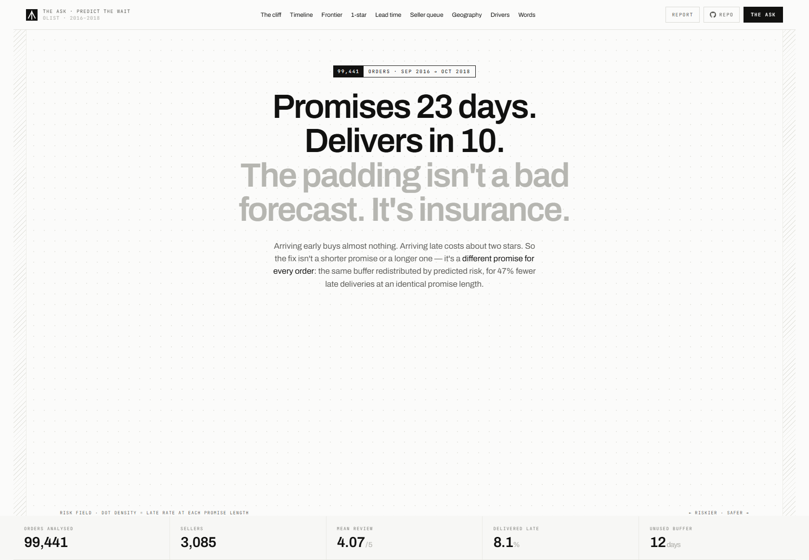
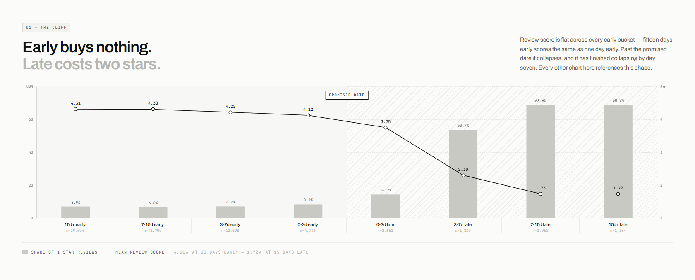
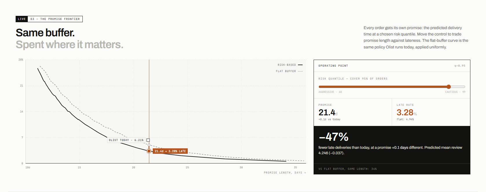
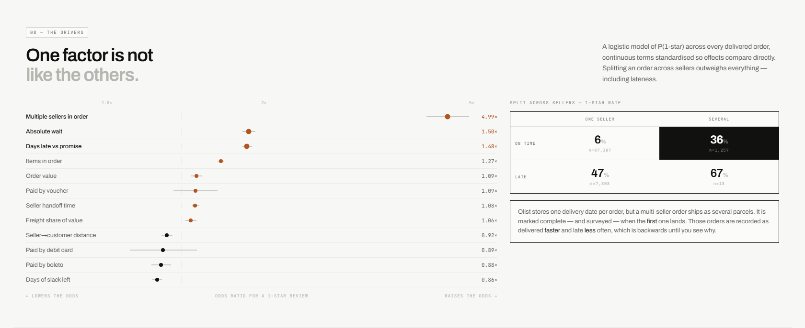
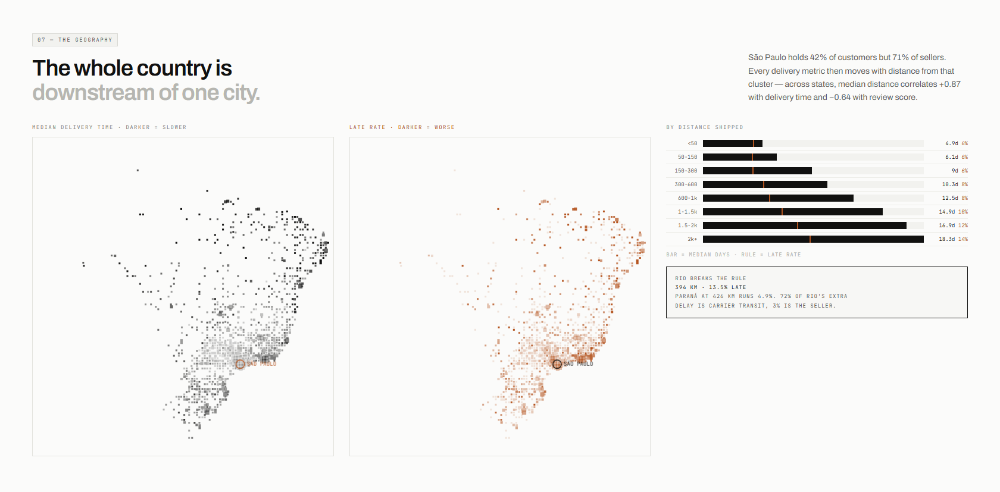
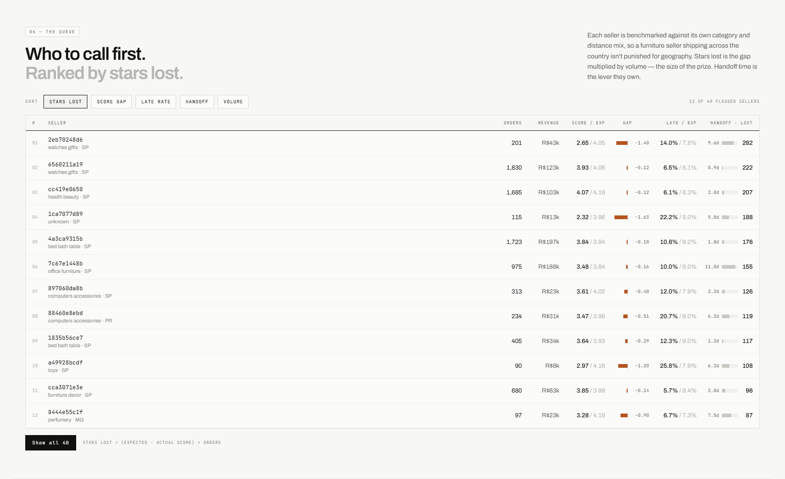

<div align="center">

# The Promise Problem

**What actually drives customer satisfaction on the Olist marketplace**

An analysis of **99,441 real orders** placed in Brazil between September 2016 and October 2018.

[**Interactive dashboard**](https://varadharajanv0310.github.io/olist-promise-problem/) ·
[**Analysis report**](https://varadharajanv0310.github.io/olist-promise-problem/report/) ·
[**Colab notebook**](notebook/olist_promise_problem.ipynb) ·
[**Demo video**](https://youtu.be/-rFrEELwZT8)



</div>

---

## The finding

Olist promises delivery in a median of **23 days** and actually delivers in **10**.

Twelve days of padding. The obvious reading is that the forecasting is broken and the estimates
should be tightened. That reading is wrong, and the data contains the proof.



Satisfaction does not decay as delivery slips. It holds almost perfectly flat right up to the
promised date, then collapses — and the damage has finished by about day seven.

| Delivery vs. promise | Orders | Mean score | 1-star rate |
|---|---:|---:|---:|
| 15d+ early | 29,594 | 4.31 | 6.9% |
| 7–15d early | 41,709 | 4.30 | 6.6% |
| 3–7d early | 12,598 | 4.22 | 6.9% |
| 0–3d early | 4,743 | 4.12 | 8.2% |
| 0–3d **late** | 2,662 | 3.75 | 14.2% |
| 3–7d **late** | 1,819 | **2.30** | **53.7%** |
| 7–15d **late** | 1,961 | 1.73 | 68.6% |
| 15d+ **late** | 1,384 | 1.72 | 68.9% |

Arriving fifteen days early instead of three is worth **+0.10 stars**. Slipping from three days late
to seven costs **−1.45** and triples the 1-star rate. The padding is not sloppiness — it is insurance
against a wildly asymmetric downside.

**And tightening it has already been tried.** Between January 2017 and August 2018 Olist cut its
median promise from **39 days to 13** while actual delivery improved by under four. The late rate
tripled, from 3.1% to 10.4%. The dataset contains the post-mortem on the obvious recommendation.

---

## The recommendation

Don't shorten the promise. Don't lengthen it. **Stop making one promise for the whole platform.**

Olist applies the same twelve-day buffer to a 160 km São Paulo order and a 2,400 km order to Pará —
too slow where it is safe, too tight where it is not. Predict each order's delivery-time distribution
at checkout instead, and promise a chosen quantile of it.



| Policy | Mean promise | Late rate |
|---|---:|---:|
| Olist today (flat buffer) | 21.4 d | **6.21%** |
| Risk-based, q=0.90 | 17.3 d | 7.32% |
| **Risk-based, q=0.95** | **21.4 d** | **3.28%** |

**At an identical customer-facing promise length, 47% fewer late deliveries.** Not a trade-off — a
strictly better operating point, because the buffer is *reallocated* rather than cut: taken off the
orders that never needed twelve days of insurance and given to the ones that always did.

Measured on **25,352 held-out orders** the model never saw. Trained on 71,118 orders through April
2018 and tested on May–August; every feature is knowable at checkout, and seller-history features are
built from the training window only, so nothing leaks backward.

---

## What else the analysis found

### Delivery explains just under half the problem



| Source of 1-star reviews | Share |
|---|---:|
| Delivered late | 31.0% |
| Never arrived at all | 17.7% |
| **Delivered on time — and still 1 star** | **51.2%** |

**48.8% of one-star reviews are a delivery failure. The other 51.2% arrived on time and the customer
was unhappy anyway.** The promise is the biggest single lever available, not the whole story, and a
report claiming otherwise would be overselling.

### The largest single driver isn't lateness

A logistic model of P(1-star) across 95,978 delivered orders returns **multi-seller orders at 4.99×
the odds** — larger than any delivery term. It survives four attempts to break it:

- Among **on-time** orders, multi-seller runs 36.0% one-star against 6.4%
- Holding basket size fixed at 2, 3, 4 and 5 items, splitting across sellers loses ~0.9 stars every time
- *"Only part arrived"* appears in 29.6% of multi-seller one-star reviews against 7.5% otherwise
- Multi-seller orders are recorded as delivered **faster** and late **less** often — which is backwards, unless the timestamp is capturing the first parcel

**Olist stores one `order_delivered_customer_date` per order.** A multi-parcel order is marked
complete — and surveyed — when the first box lands. The customer is asked to rate a finished order
while holding half of one. That is a schema problem, not a logistics one.

### It's distance, not geography



São Paulo holds 42% of customers but **71% of sellers**; the top three states supply 87% of all
orders. Across states, median seller-to-customer distance correlates **+0.87 with delivery time**,
**+0.87 with freight burden** and **−0.64 with review score**.

One state breaks the rule: **Rio de Janeiro** sits closer to its sellers than Paraná (394 km vs 426)
yet runs a **13.5% late rate against Paraná's 4.9%**. Decomposing the gap — 72% is carrier transit,
3% is seller handoff — and orders *out of* Rio perform normally. It is a destination-side last-mile
problem, worst in the periphery: São Gonçalo 24.9% late against Rio city's 11.8%.

### Who to call first



A raw seller rating is unfair in both directions: a seller shipping heavy furniture to Pará is set up
to score badly, and a 2.1-star seller with nine orders is a rounding error beside a 3.9-star seller
with nine hundred. So each seller is benchmarked against **their own category and distance mix**,
then ranked by **stars lost** (volume × shortfall).

The spread survives the control — **0.75 stars wide** from the 10th to the 90th percentile — and the
mechanism is one sellers control: mix-adjusted performance correlates −0.37 with handoff time, and
the worst decile hands off in 3.0 days against the best decile's 1.1.

Two findings make it actionable: **seller size is uncorrelated with quality** (r = −0.011), and the
**top 100 sellers control 55% of revenue while performing only averagely**.

---

## Three recommendations this analysis killed

The section of the report I'd point at first. Showing what was disproved is rarer, and more useful,
than showing what was found.

**1. "Your delivery estimates are inaccurate — tighten them."**
The asymmetry says earliness buys 0.10 stars and lateness costs 1.45. And Olist already ran this
experiment for nineteen months: the promise fell 39 → 13 days and the late rate tripled.

**2. "Delay the survey so customers aren't rating undelivered orders."**
The survey fires at `estimated_delivery_date + 2 days`, so **37% of all one-star reviews are written
before the parcel arrives**. That looked like a measurement artifact with a cheap fix. That trigger
creates a sharp cutoff, so it can be tested as a **regression discontinuity** — the estimate came
back at **+0.15 stars (SE 0.19)**, indistinguishable from zero at every bandwidth, with placebo
cutoffs and a donut specification agreeing. The anger is real. Moving the survey changes nothing.

**3. "Focus on your worst-rated sellers."**
Raw rating targets small sellers with noisy averages. Ranking by stars lost against each seller's own
benchmark targets the ones whose underperformance actually reaches customers.

---

## Method

| | |
|---|---|
| **Grain** | All nine tables reduced to one analytical row per order — 99,441 rows × 65 columns |
| **Joins** | Guarded: every join asserts the row count is unchanged |
| **Distance** | Haversine between zip-prefix centroids, clipped to Brazil's bounding box; 98.7% coverage |
| **Driver model** | Logistic regression on **P(1-star)**, fitted by IRLS in numpy, terms standardised so odds ratios compare |
| **Falsification** | Regression discontinuity with HC1 robust errors, placebo cutoffs, donut specification |
| **Promise model** | Gradient-boosted quantile regression, time-based split, no leakage |
| **Seller benchmark** | Category × distance cells, ranked by volume × shortfall |

**Why P(1-star) and not the mean score:** the distribution is bimodal — 57% fives, 12% ones, very
little in between. A mean averages two populations that barely overlap. The business question is not
"how satisfied is the average customer" but "what makes someone furious", which is a probability.

**No `statsmodels`.** Version 0.14.4 fails to import against `scipy` ≥ 1.16 (`_lazywhere` was removed
from `scipy._lib._util`), which is the pairing Colab ships. Every statistical routine here — OLS with
robust errors, the regression discontinuity, the logistic driver model — is written directly in numpy.

### Cleaning decisions that change the answers

These are genuine characteristics of an operational export, not planted defects:

| | Found | Handled |
|---|---|---|
| Duplicate `review_id` | 827, across 555 orders surveyed more than once | Deduped to the first survey per order |
| Orders with **no line items** | 775 — overwhelmingly the cancelled and unavailable ones | **Left** joins; an inner join silently deletes the platform's worst outcomes |
| Geolocation fan-out | ~53 rows per zip prefix | Collapsed to one point per prefix before joining |
| Untranslated categories | 2 of 73 | Hand-added |
| Export edge months | Sep 2016 = 4 orders, Dec 2016 = 1, Sep/Oct 2018 = 16 and 4 | Trend window restricted to **Jan 2017 – Aug 2018** |
| `not_defined` payments | 3 records, R$0.00, all undelivered | Flagged, not silently kept |

---

## Repository

```
notebook/     the submission notebook — 66 cells, runs top to bottom in Colab
report/       the analysis report (template + build script)
dashboard/    the interactive frontend (template + data payload + build script)
docs/         the deployed site, served by GitHub Pages
scripts/      24 scripts: extraction → cleaning → Q1–Q6 → models → charts → exports
figures/      30 figures
reports/      17 text outputs, one per analysis stage
video/        the demo script
linkedin/     the write-up post
```

### Reproducing it

The dataset is **not committed** — it's CC BY-NC-SA and ~150 MB. Download the
[Brazilian E-Commerce Public Dataset by Olist](https://www.kaggle.com/datasets/olistbr/brazilian-ecommerce),
put the nine CSVs in `data/raw/`, then:

```bash
python scripts/10_build_base.py        # cleaning → data/processed/orders_analytical.parquet
python scripts/20_q1_trends.py         # …through 26_multiseller.py for the core questions
python scripts/30_risk_scorer.py       # the promise model
python scripts/31_seller_scorecard.py  # the seller benchmark
python scripts/50_build_notebook.py    # regenerate the notebook
python scripts/52_verify_notebook.py   # execute it and assert it runs clean
```

`52_verify_notebook.py` validates against the nbformat schema, compiles every cell from the verbatim
concatenation Jupyter performs, then executes the whole notebook through nbclient. **37/37 cells, 0
errors, 13 figures.**

---

## Limitations

This is observational data. We identify associations; only the regression discontinuity supports a
causal reading, and it is a null result. The driver model ranks factors by conditional association,
not proven effect.

Reviews arrive for 99.4% of orders, so selection into reviewing is not a serious concern — but the
survey trigger means late orders are systematically rated earlier in their lifecycle, which is
quantified rather than corrected.

The dataset ends abruptly in August 2018, so the encouraging trend in the final months cannot be
confirmed as durable. Distances are great-circle between zip-prefix centroids, not routed road
distance, and ~1.3% of orders cannot be located. Seller and customer identifiers are hashed.

Finally, the risk model is trained and tested inside a single platform's operating regime. It
predicts what delivery times *were* under Olist's existing carrier mix; it does not forecast what
they would become if that mix changed.

---

<div align="center">

Built for the **Data Analytics Hackathon** conducted by
[Gradient Learning](https://www.linkedin.com/company/gradientlearnings).

Data: [Brazilian E-Commerce Public Dataset by Olist](https://www.kaggle.com/datasets/olistbr/brazilian-ecommerce), CC BY-NC-SA.
Real commercial data released for public analysis — not generated for this exercise.

</div>
